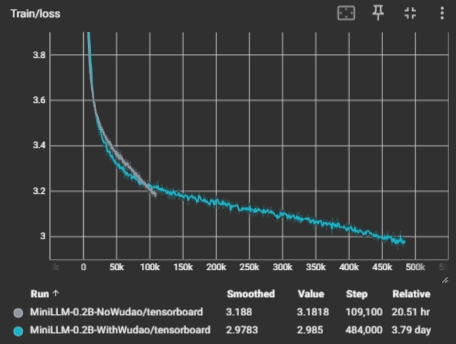
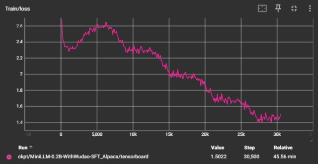
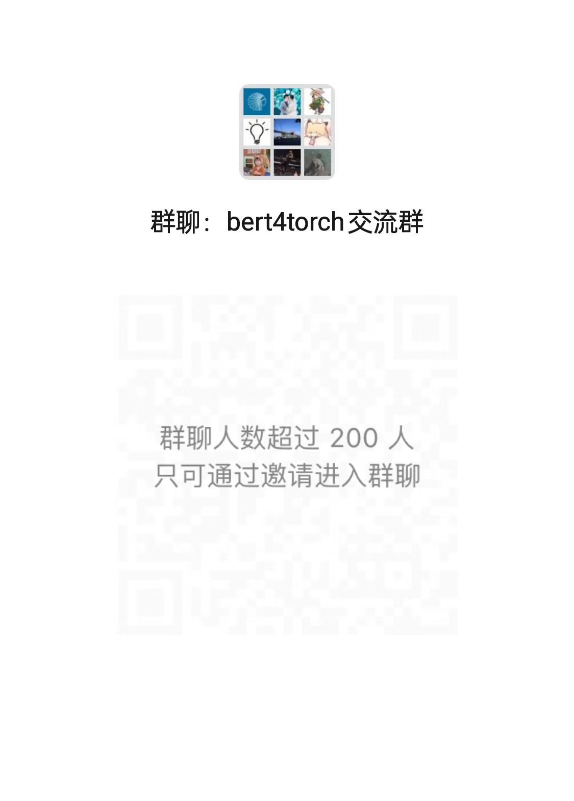

# build_llm_from_scratch

[](https://github.com/Tongjilibo/build_llm_from_scratch/blob/master/LICENSE)
[](https://github.com/Tongjilibo/build_llm_from_scratch/releases)
[](https://github.com/Tongjilibo/build_llm_from_scratch)
[](https://github.com/Tongjilibo/build_llm_from_scratch/issues)
[](https://github.com/Tongjilibo/build_llm_from_scratch/issues)
[](https://github.com/Tongjilibo/build_llm_from_scratch/blob/master/docs/pics/wechat_group.jpg)

[Bert4torch](https://github.com/Tongjilibo/bert4torch) |
[Torch4keras](https://github.com/Tongjilibo/torch4keras)

## 1. 介绍
- **初衷**：本项目旨在构建一个小参数量的llm，完整走完`预训练` -> `指令微调`  -> `奖励模型`  -> `强化学习` 四个阶段，以可控的成本完成一个可以完成简单聊天任务的chat模型
- **特色**: 使用[bert4torch](https://github.com/Tongjilibo/bert4torch)训练框架，代码简介高效；优化了训练时候内存占用；提供了完整训练log供复现比对

## 2. 快速开始
- 环境安装
```shell
pip install git+https://github.com/Tongjilibo/torch4keras.git
pip install git+https://github.com/Tongjilibo/bert4torch
```
- 训练脚本
```shell
# 预训练
cd pretrain
nohup torchrun --standalone --nproc_per_node=4 pretrain.py --name baby > nohup.log&

# 预训练推理（命令行聊天）
cd pretrain
python infer.py

# 指令微调训练

# 指令微调推理
```

## 3. 更新历史

## 4. 预训练
### 4.1 预训练语料（源于[baby-llama2-chinese](https://github.com/DLLXW/baby-llama2-chinese)）
| 中文预训练语料               | 描述                                      |
|-------------------------|----------------------------------------|
| [Wiki中文百科](https://huggingface.co/datasets/pleisto/wikipedia-cn-20230720-filtered)| 中文Wikipedia的数据 |
| [BaiduBaiKe](https://pan.baidu.com/s/1jIpCHnWLTNYabftavo3DVw?pwd=bwvb) 提取码: bwvb| 中文BaiduBaiKe的数据|
| [C4_zh：part1](https://pan.baidu.com/s/18O2Tj_PPB718K8gnaWrWUQ) 提取码：zv4r；[C4_zh：part2](https://pan.baidu.com/s/11PTgtUfFXvpNkOige9Iw4w) 提取码：sb83；[C4_zh：part3](https://pan.baidu.com/s/1248QfTS8QHPojYW-0fd5jQ) 提取码：l89d | C4是可用的最大语言数据集之一，收集了来自互联网上超过3.65亿个域的超过1560亿个token。C4_zh是其中的一部分 |
| [WuDaoCorpora](https://data.baai.ac.cn/details/WuDaoCorporaText) | 中文悟道开源的200G数据|
| [shibing624/medical](https://huggingface.co/datasets/shibing624/medical/tree/main)| 源自shibing624的一部分医学领域的预训练数据 |

项目开源了经过ChatGLM2-6B的分词器处理后的预训练语料，共计**634亿Tokens**的数据量，链接如下：[Corpus](https://pan.baidu.com/s/18o4gF-G68qfgOGWQXgAg3g) 提取码：6unr。将下载好的数据放到./data目录下即可。

### 4.2 预训练权重
|预训练权重 | 预训练语料                    | 下载地址                       |
|----------------------------|--------------------------|---------------------|
| L12_H1024_A8-NoWudao       | （140亿 Tokens）<br/>Wiki中文百科<br/>+BaiduBaiKe<br/>+shibing624/medical<br/>+C4_zh | [百度网盘](https://pan.baidu.com/s/1Zvk2Nuf7fsOPKJOk-Tjjcg?pwd=1oel) 提取码:1oel|
| L12_H1024_A8-WithWudao       | （640亿 Tokens）<br/>Wiki中文百科<br/>+BaiduBaiKe<br/>+shibing624/medical<br/>+C4_zh<br/>+WuDaoCorpora  | [百度网盘](https://pan.baidu.com/s/1Zvk2Nuf7fsOPKJOk-Tjjcg?pwd=1oel) 提取码:1oel|

### 4.3 预训练过程


### 4.4 预训练续写
- L12_H1024_A8-NoWudao
```shell
用户：小明学习优异、身体健康、是一名

续写：小明学习优异、身体健康、是一名优秀的大连理工大学学生，从大学一年级起，他就对体育十分痴迷，成绩名列前茅，还参加了多项比赛，在全校体育活动中，他成绩名列前茅，被大连理工大学授予“优秀运动员”称号。
2006年，高中二年级，小明的同学杨帆来到大连理工大学，他决心要改变自己的命运。他每天放学后，都会跑到操场上练习篮球，练到下午三点多钟时，小明的篮球技术开始显现出来，他的篮球动作敏捷，力量大，而且，他经常利用空档时间练习跳投


用户：床前明月光，疑是地上霜。举头望明月，

续写：床前明月光，疑是地上霜。举头望明月，低头思故乡……”
我读着这些诗句时也倍感亲切和亲切了！
```
- L12_H1024_A8-WithWudao
```shell
用户：小明学习优异、身体健康、是一名

续写：小明学习优异、身体健康、是一名优秀的教师。他为人诚实、有责任心。在课堂上，他能认真听讲，积极思考，对每节课都积极举手发言。在课后，他主动要求帮助老师，认真做好作业，按时完成老师布置的作业，受到同学们的好评。


用户：床前明月光，疑是地上霜。举头望明月，

续写：床前明月光，疑是地上霜。举头望明月，低头思故乡。”这诗不仅描述了中秋夜月夜的温馨与宁静，还写出了作者对故土深情的眷恋和思乡之情。“月上柳梢头”一语，是写月下所见。“欲将心事付瑶琴”，指欲诉别情； “举头望明月”，写中秋之夜，月上高挂、皓月当空、群星闪耀的景象；“低头思故乡”，写思念故土的深情厚意。
这首诗在写作手法上，主要运用象征
```

## 5、指令微调
### 5.1 指令微调语料
| 数据集名称     | 介绍               |
| ---------------- | -------------------- |
|[shibing624/alpaca-zh](https://huggingface.co/datasets/shibing624/alpaca-zh)|参考Alpaca方法基于GPT4得到的self-instruct数据，约5万条|
|[BelleGroup/Belle-0.5M-cn](https://huggingface.co/datasets/BelleGroup/train_0.5M_CN)|包含约50万条由BELLE项目生成的中文指令数据||
|[BelleGroup/Belle-1M-cn](https://huggingface.co/datasets/BelleGroup/train_1M_CN)| 包含约100万条由BELLE项目生成的中文指令数据|
|[YeungNLP/firefly-train-1.1M](https://huggingface.co/datasets/YeungNLP/firefly-train-1.1M)|流萤23种常见的中文NLP任务的数据，并且构造了许多与中华文化相关的数据，如对联、作诗、文言文翻译、散文、金庸小说等。对于每个任务，由人工书写若干种指令模板，保证数据的高质量与丰富度，数据量为115万|

### 5.2 指令微调权重
|指令微调权重 | 语料            | 下载地址                       |
|----------------------------|-------------------------|--------------------------|
| L12_H1024_A8-WithWudao-SFT_Alpaca| [shibing624/alpaca-zh](https://huggingface.co/datasets/shibing624/alpaca-zh) | [百度网盘](https://pan.baidu.com/s/1Zvk2Nuf7fsOPKJOk-Tjjcg?pwd=1oel) 提取码:1oel|

### 5.3 训练过程


### 5.4 指令微调Chat
- L12_H1024_A8-WithWudao-SFT_Alpaca
```shell
User：你好

Assistant：你好！很高兴见到你。

User：你能做什么？

Assistant：你好！我是一个人工智能助手，有什么我可以为你做的吗？

User：番茄炒蛋怎么制作？

Assistant：如果你想要制作一个番茄炒蛋，那么下面这些步骤可能会帮助你：

1. 准备食材：准备好鸡蛋、盐、香菜、胡萝卜丝、黄瓜丝等食材。
2. 清洗鸡蛋：在搅拌碗中打散鸡蛋，使其表面可以清洁。
3. 准备材料：准备一个锅，倒入适量的水，将鸡蛋液倒入锅中。
4. 煮鸡蛋：用汤锅或锅煎至鸡蛋表面金黄色，熟透即可。
5. 炒蔬菜：在锅中加入适量的油，将胡萝卜丝和黄瓜丝个人喜欢的，翻炒几下，直到胡萝卜熟透。
6. 加入鸡蛋：从锅中取出鸡蛋，倒入锅中。
7. 调味：将炒好的鸡蛋倒入锅中，与蔬菜一起翻炒几下即可。

注意：想要炒出更丰富的蔬菜味道，可以适当加入适量的盐和香菜，增加风味。
```

## 6. 鸣谢

- 感谢[baby-llama2-chinese](https://github.com/DLLXW/baby-llama2-chinese)，本实现有不少地方参考该项目

## 7. 引用

```
@misc{build_llm_from_scratch,
  title={build_llm_from_scratch},
  author={Bo Li},
  year={2024},
  howpublished={\url{https://github.com/Tongjilibo/build_llm_from_scratch}},
}
```

## 9. 其他

- Wechat & Star History Chart

<table border="0">
  <tbody>
    <tr align="center" >
      <td>
         <a href="https://github.com/Tongjilibo"></a><br>
         <a href="https://github.com/Tongjilibo">微信号</a> 
      </td>
      <td>
         <a href="https://github.com/Tongjilibo"></a><br>
         <a href="https://github.com/Tongjilibo">微信群</a> 
      </td>
      <td>
         <a href="https://star-history.com/#Tongjilibo/bert4torch&Date"></a><br>
         <a href="https://star-history.com/#Tongjilibo/bert4torch&Date">Star History Chart</a> 
      </td>    
      </tr>
  </tbody>
</table>
